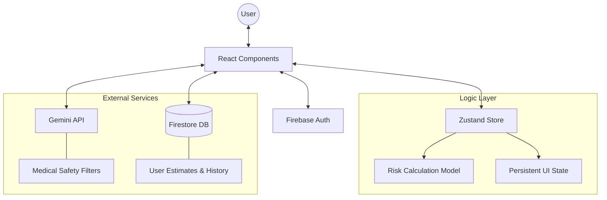

# 🏗️ Aarogya Path — Workshop Architecture

This document provides a comprehensive technical blueprint of the **Aarogya Path** platform. It is designed for developer onboarding, technical workshops, and stakeholder architectural review.

---

## 🌟 Project Vision
Aarogya Path is a premium healthcare fintech application that bridges the gap between medical needs and financial clarity. By combining AI-driven estimation with a high-fidelity dashboard, it empowers users to navigate the complex landscape of healthcare costs with confidence.

---

## 🛠 Technology Stack

| Layer | Technology | Role |
| :--- | :--- | :--- |
| **Frontend Core** | React 19 + Vite | High-performance, reactive UI framework. |
| **Styling** | Tailwind CSS 3.4 | Utility-first styling for rapid development. |
| **Design System** | **Medicana** (Custom) | Premium Glassmorphic design language. |
| **Animations** | Framer Motion | Smooth page transitions and micro-interactions. |
| **State Management** | Zustand | Lightweight, persistent client-side state. |
| **Backend/Auth** | Firebase | Cloud Firestore & Authentication. |
| **AI Engine** | Google Gemini | Large Language Model for healthcare assistance. |
| **Data Viz** | Recharts | Visualization of health and spending trends. |

---

## 📐 System Architecture

The following diagram illustrates the flow of data and service integration within Aarogya Path:

---

## 📂 Core Component Breakdown

### 1. Structural Components
- **`Layout.jsx`**: The unified shell containing the navigation, sidebar, and theme-consistent background.
- **`ProtectedRoute.jsx`**: A wrapper component ensuring certain features (Dashboard, AI Chat) are restricted to authenticated users.

### 2. Primary Modules
- **`Dashboard/`**: The "Command Center" displaying health KPIs, saving/managing providers, and visualizing cost risks.
- **`CostEstimator/`**: A complex, multi-step state machine using Zustand to collect patient data and procedure requests.
- **`AIChat/`**: A real-time chat interface integrated with Gemini, featuring conversation history persistence in Firestore.
- **`Providers/`**: Discovery logic for hospitals and labs, including detailed service benchmarking and "Infrastructure Gap" analysis.

---

## 🧠 Business Logic: Financial Risk Model

Our proprietary model evaluates the impact of healthcare expenses relative to a user's liquid financial standing.

### The Formula:
`Risk Score = (Average Estimated Cost / (Monthly Income)) * 20`
*Note: The score is capped at 100.*

### Risk Zones:
- **🟢 Safe (<15):** Cost is less than 0.75 months of income.
- **🟠 Caution (15-40):** Cost is between 0.75 and 2 months of income.
- **🔴 High Risk (>40):** Cost exceeds 2 months of income.

---

## 🤖 AI Integration & Safety
The **Aarogya Health AI** uses the `@google/generative-ai` SDK.

1. **Context Management**: Chat history is stored in Firestore and loaded into the Gemini prompt during sessions.
2. **Safety Guardrails**: The system prompt is strictly configured to act as an information provider, explicitly stating it is NOT a medical professional.
3. **Real-time Streaming**: Uses async-await patterns for a fluid, typing-effect response UI.

---

## 🗄️ Database Schema (Firestore)

| Collection | Purpose | Key Fields |
| :--- | :--- | :--- |
| **`estimates`** | Stores user cost calculations. | `userId`, `procedures`, `totalCost`, `timestamp` |
| **`chat_history`** | Persistent AI conversations. | `userId`, `messages[]`, `lastActive` |
| **`users`** | Basic profile information. | `displayName`, `email`, `settings`, `profileCreated` |

---

## 🎨 Design Philosophy: "Medicana"
The Medicana design system focuses on:
- **Glassmorphism**: Translucent surfaces using CSS `backdrop-filter`.
- **Dynamic Feedback**: Hover states and progress indicators for every interaction.
- **Visual Hierarchy**: Careful use of Deep Navy (Professionalism) and Teal (Healthcare Trust).

---

## 👤 Credits & Ownership
- **Developer**: Ayushi Aggarwal
- **Framework**: Developed as part of a high-fidelity healthcare fintech initiative.
- **Version**: 1.0 (Production Optimized)
